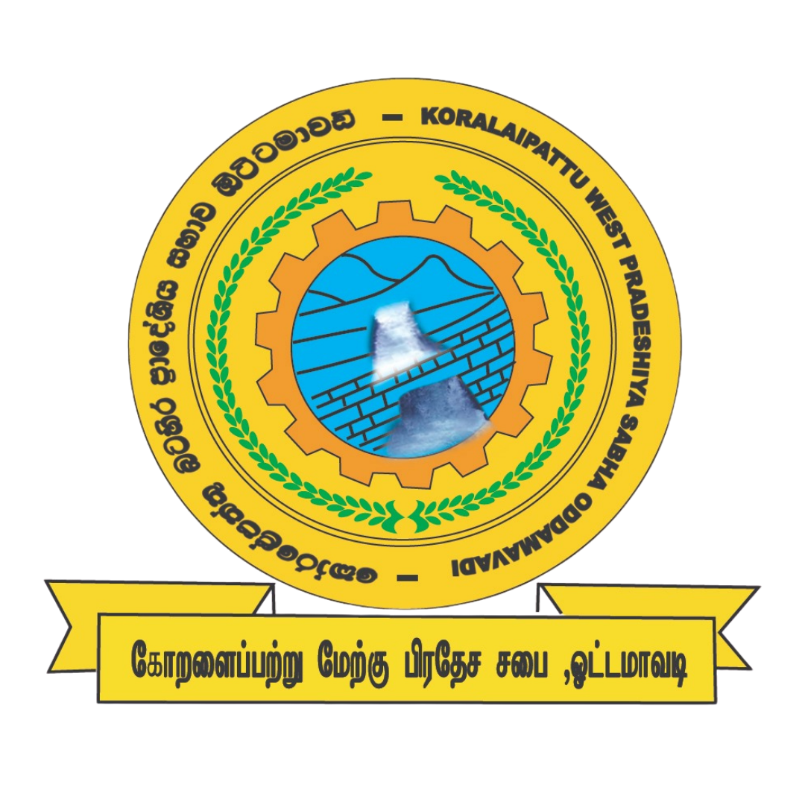

# Launch Ceremony Webpage — Development Plan
## Koralaipattu West Oddamavadi Development Plan 2026–2035

---

## 1. Project Overview

A fullscreen ceremonial webpage displayed on a smartboard during the official launching ceremony. Seven guests sequentially press a single on-screen button — each press advances a progress bar, changes the displayed copy, and culminates in a full-screen celebration with confetti, blast effects, and a project-initiated declaration. The pre-celebration content fits in one viewport (no scroll). The celebration is a separate full-screen section that auto-scrolls into view on the final click.

---

## 2. Technical Stack

| Layer | Choice | Reason |
|---|---|---|
| Framework | Vanilla HTML + CSS + JS (single `.html` file) | Zero build step, runs offline from USB on any smartboard browser |
| Fonts | Google Fonts: `Playfair Display` (headings) + `Source Sans 3` (body) | Formal serif + clean readable body — appropriate for government |
| Confetti | `canvas-confetti` via `cdn.jsdelivr.net` | Lightweight, battle-tested, no dependencies |
| Animations | CSS keyframes + Web Animations API | Full control, no library overhead |
| Logos | `` tags pointing to `logos/` folder | Easy to swap real PNG/SVG assets |
| Deployment | Static file — open in Chrome/Edge fullscreen (F11) | No server required |

---

## 3. Page Architecture

```
index.html
│
├── Section A: Ceremony Screen  [100vh, overflow hidden]
│   ├── Logo Block              (UDA + KW PS logos, centered row)
│   ├── Gold Divider Line
│   ├── Event Title Block       (plan name, ceremony name)
│   ├── Meta Block              (date · venue)
│   ├── Gold Divider Line
│   ├── Progress Block          (message label + bar + count)
│   ├── Button Block            (single centered button)
│   └── Tagline                 (pinned to bottom)
│
└── Section B: Celebration Screen  [100vh, hidden until triggered]
    ├── Radial burst rings (CSS animation)
    ├── Launch Stamp (circular CSS seal graphic)
    ├── "Project Officially Initiated" hero text
    ├── Plan name + year range
    ├── Tagline
    ├── Credit line (UDA · KW PS)
    └── Confetti (canvas-confetti, fires on scroll-in)
```

---

## 4. Content & Copy

### 4.1 Static Header Content

```
Logo row:   [UDA emblem]     [KW Pradeshiya Shaba emblem]   (centered row)
Line 1:     KORALAIPATTU WEST ODDAMAVADI  (small caps label)
Line 2:     Development Plan 2026 – 2035  (h1, Playfair Display)
Sub-event:  Launching Ceremony & Initial Stakeholder Meeting
Date:       07 April 2026
Venue:      Gathering Center, Koralaipattu West Pradeshiya Shaba, Oddamavadi
```

### 4.2 Seven-Step Progress Stages

| Step | Button Label | Progress Message |
|------|-------------|------------------|
| 0 (initial) | `Press to Begin the Ceremony` | "Awaiting participation to commence the official launch…" |
| 1 | `Continue the Ceremony` | "The ceremony has been formally initiated. Step 1 of 7 complete." |
| 2 | `Continue the Ceremony` | "Participation grows. The foundation of our plan is being laid." |
| 3 | `Continue the Ceremony` | "Halfway through. The collective vision is taking shape." |
| 4 | `Continue the Ceremony` | "Momentum builds. Our commitment to development grows stronger." |
| 5 | `Continue the Ceremony` | "Five voices united. Two steps remain to complete this milestone." |
| 6 | `Continue the Ceremony` | "One final act will complete our shared journey." |
| 7 (auto) | *(button hidden — celebration triggers)* | "All participants have spoken. The plan is now officially launched!" |

> Button label stays constant after step 1. Only the message and bar width change — creating a calm, intentional ceremony rhythm.

### 4.3 Celebration Screen Copy

```
Hero text:   Project Officially Initiated
Sub-hero:    Koralaipattu West Oddamavadi Development Plan 2026 – 2035
Stamp:       LAUNCHED · 07.04.2026
Tagline:     "Voice Together, Sustainable Future of Koralaipattu West Oddamavadi PS"
Credits:     Urban Development Authority  ·  Koralaipattu West Pradeshiya Shaba
```

---

## 5. Visual Design Specification

### 5.1 Color Palette

```css
:root {
  --bg-deep:    #0a1628;                   /* deep navy — primary background */
  --gold:       #C8A84B;                   /* government gold — primary accent */
  --gold-light: #E8C96A;                   /* hover / highlight gold */
  --green:      #1A6E45;                   /* national green — secondary accent */
  --green-l:    #2AAD6D;                   /* progress bar bright end */
  --text-white: #FFFFFF;
  --text-muted: #8FB8D4;
  --border-dim: rgba(200, 168, 75, 0.25);
}
```

### 5.2 Typography Scale

```css
.plan-label     { font: 600 11px/1 'Source Sans 3'; letter-spacing: 0.18em; text-transform: uppercase; color: var(--gold); }
.event-name     { font: 700 30px/1.2 'Playfair Display'; color: #fff; }
.event-subtitle { font: 400 16px/1.5 'Source Sans 3'; color: var(--text-muted); }
.meta-text      { font: 400 12px/1 'Source Sans 3'; letter-spacing: 0.08em; text-transform: uppercase; color: var(--text-muted); }
.progress-label { font: 400 14px/1.6 'Source Sans 3'; color: var(--gold); font-style: italic; text-align: center; }
.progress-count { font: 600 11px/1 'Source Sans 3'; color: var(--text-muted); text-align: right; }
.btn-text       { font: 600 13px/1 'Source Sans 3'; letter-spacing: 0.1em; text-transform: uppercase; }
.tagline        { font: 400 11px/1 'Source Sans 3'; font-style: italic; color: rgba(200,168,75,0.55); }

/* Celebration */
.hero-text { font: 700 52px/1.1 'Playfair Display'; color: var(--gold); }
.hero-sub  { font: 400 20px/1.5 'Source Sans 3'; color: #fff; }
```

### 5.3 Layout — Section A Vertical Stack

Using `vh` units throughout so layout scales perfectly on any screen height:

```
padding: 4vh 24px
[logo row]           height: 64px, gap: 32px between logos
[gold divider]       width: 60px, height: 1px, margin: 2vh 0
[plan-label]         "KORALAIPATTU WEST ODDAMAVADI"   margin-top: 0
[event-name h1]      "Development Plan 2026 – 2035"   margin-top: 4px
[event-subtitle]     "Launching Ceremony…"             margin-top: 8px
[meta-row]           date · venue                      margin-top: 1.5vh
[gold divider]       same as above                     margin-top: 1.5vh
[progress-label]     italic gold message               margin-top: 3vh
[progress-track]     max-width: 480px                  margin-top: 1vh
[progress-count]     "3 of 7" right-aligned            margin-top: 6px
[ceremony-btn]       centered                          margin-top: 4vh
[tagline]            position: absolute; bottom: 2.5vh
```

All content is `display: flex; flex-direction: column; align-items: center` on `#ceremony`.

### 5.4 Button Design

```css
.ceremony-btn {
  background: var(--gold);
  color: var(--bg-deep);
  border: none;
  border-radius: 3px;
  padding: 20px 52px;
  cursor: pointer;
  position: relative;
  overflow: hidden;
  transition: transform 0.15s ease, box-shadow 0.2s ease;
  touch-action: manipulation;   /* prevents 300ms delay on touch screens */
}

/* Shine sweep on click */
.ceremony-btn::after {
  content: '';
  position: absolute;
  top: 0; left: -100%;
  width: 60%; height: 100%;
  background: linear-gradient(90deg, transparent, rgba(255,255,255,0.35), transparent);
  transform: skewX(-20deg);
  transition: none;
}
.ceremony-btn.shine::after {
  animation: btnShine 0.5s ease forwards;
}
@keyframes btnShine {
  to { left: 160%; }
}

.ceremony-btn:hover    { transform: translateY(-3px); box-shadow: 0 10px 30px rgba(200,168,75,0.4); }
.ceremony-btn:active   { transform: scale(0.97); }
.ceremony-btn:disabled { cursor: not-allowed; opacity: 0.65; transform: none; }
```

### 5.5 Progress Bar

```css
.progress-track {
  width: 100%;
  max-width: 480px;
  height: 10px;
  background: rgba(255,255,255,0.08);
  border-radius: 999px;
  overflow: hidden;
  border: 0.5px solid rgba(200,168,75,0.15);
}
.progress-fill {
  height: 100%;
  background: linear-gradient(90deg, var(--green) 0%, var(--gold) 100%);
  border-radius: 999px;
  width: 0%;
  transition: width 0.9s cubic-bezier(0.4, 0, 0.2, 1);
}
```

Progress widths by step: 0% → 14.3% → 28.6% → 42.9% → 57.1% → 71.4% → 85.7% → 100%

### 5.6 Subtle Background Depth

```css
body::before {
  content: '';
  position: fixed; inset: 0;
  background:
    radial-gradient(ellipse 60% 50% at 50% 35%, rgba(26,110,69,0.10) 0%, transparent 65%),
    radial-gradient(ellipse 40% 30% at 50% 65%, rgba(200,168,75,0.05) 0%, transparent 60%);
  pointer-events: none;
  z-index: 0;
}
```

---

## 6. Interaction Flow — State Machine

```
STATE 0: IDLE
  Display: initial message + "Press to Begin the Ceremony"
  Bar: 0%

[User clicks button]
  → Button disables immediately
  → Shine animation fires (500ms)
  → step++
  → Progress bar animates to new width (900ms ease)
  → Progress label: fade out (300ms) → swap text → fade in (300ms)
  → Progress count updates: "N of 7"
  → Button text updates, re-enables (at 650ms)

STATES 1–6: IN PROGRESS
  Same cycle. Button label = "Continue the Ceremony"

STATE 7: FINAL CLICK
  → Bar fills to 100%
  → Final label appears
  → Button fades + shrinks (delay 400ms, duration 400ms)
  → After 1500ms total: smooth scroll to Section B
  → Celebration sequence begins

CELEBRATION SEQUENCE:
  T +0ms    section B visibility:visible; fade in over 600ms
  T +200ms  burst rings animate outward (3 rings, staggered)
  T +400ms  stamp scales in with spring overshoot
  T +600ms  hero text scales in (0.88 → 1)
  T +850ms  sub-hero fades up
  T +1000ms tagline fades up
  T +1150ms credits fade up
  T +900ms  confetti burst 1 (center)
  T +1200ms confetti burst 2 (left cannon)
  T +1400ms confetti burst 3 (right cannon)
  T +1400ms sustained confetti rain for 4.5 seconds
```

---

## 7. Celebration Screen — Detailed Specs

### 7.1 Radial Burst Rings (CSS)

```css
.burst-ring {
  position: absolute;
  border-radius: 50%;
  top: 50%; left: 50%;
  transform: translate(-50%,-50%) scale(0);
  opacity: 1;
}
.burst-ring:nth-child(1) {
  width: 180px; height: 180px;
  border: 2px solid rgba(200,168,75,0.7);
  animation: ringOut 1s ease 0.2s forwards;
}
.burst-ring:nth-child(2) {
  width: 380px; height: 380px;
  border: 1.5px solid rgba(26,110,69,0.5);
  animation: ringOut 1.3s ease 0.35s forwards;
}
.burst-ring:nth-child(3) {
  width: 620px; height: 620px;
  border: 1px solid rgba(200,168,75,0.25);
  animation: ringOut 1.6s ease 0.5s forwards;
}
@keyframes ringOut {
  to { transform: translate(-50%,-50%) scale(1); opacity: 0; }
}
```

### 7.2 Launch Stamp Seal

```css
.launch-stamp {
  width: 130px; height: 130px;
  border-radius: 50%;
  border: 2.5px solid var(--gold);
  outline: 2px dashed rgba(200,168,75,0.45);
  outline-offset: 7px;
  display: flex; flex-direction: column;
  align-items: center; justify-content: center;
  gap: 5px;
  color: var(--gold);
  opacity: 0;
  margin-bottom: 28px;
  animation: stampIn 0.6s cubic-bezier(0.17, 0.89, 0.32, 1.28) 0.4s forwards;
}
@keyframes stampIn {
  from { opacity: 0; transform: scale(1.5) rotate(-12deg); }
  to   { opacity: 1; transform: scale(1) rotate(0deg); }
}
```

### 7.3 Confetti Configuration

```js
function launchConfetti() {
  const colors = ['#C8A84B','#E8C96A','#1A6E45','#2AAD6D','#FFFFFF','#8FB8D4'];

  // Burst 1: center spread
  confetti({ particleCount: 100, spread: 110, origin: { y: 0.55 }, colors, startVelocity: 50 });

  // Burst 2: left cannon
  setTimeout(() =>
    confetti({ particleCount: 60, angle: 60, spread: 60, origin: { x: 0, y: 0.65 }, colors }),
  300);

  // Burst 3: right cannon
  setTimeout(() =>
    confetti({ particleCount: 60, angle: 120, spread: 60, origin: { x: 1, y: 0.65 }, colors }),
  500);

  // Sustained rain: 4.5 seconds
  const end = Date.now() + 4500;
  const rain = setInterval(() => {
    if (Date.now() > end) { clearInterval(rain); return; }
    confetti({ particleCount: 10, spread: 130, origin: { y: 0 }, colors, gravity: 0.75 });
  }, 220);
}
```

---

## 8. Full HTML Skeleton

```html
<!DOCTYPE html>
<html lang="en">
<head>
  <meta charset="UTF-8" />
  <meta name="viewport" content="width=device-width, initial-scale=1.0" />
  <title>Launch Ceremony — KW Oddamavadi Development Plan 2026–2035</title>
  <link rel="preconnect" href="https://fonts.googleapis.com" />
  <link href="https://fonts.googleapis.com/css2?family=Playfair+Display:wght@400;700&family=Source+Sans+3:wght@400;600&display=swap" rel="stylesheet" />
  <style>/* === ALL CSS GOES HERE === */</style>
</head>
<body>

  <!-- ═══ SECTION A: CEREMONY ═══ -->
  <section id="ceremony">
    <div class="logo-row">
      
      
    </div>
    <div class="divider"></div>
    <p class="plan-label">Koralaipattu West Oddamavadi</p>
    <h1 class="event-name">Development Plan 2026 – 2035</h1>
    <p class="event-subtitle">Launching Ceremony &amp; Initial Stakeholder Meeting</p>
    <div class="meta-row">
      <span class="meta-text">07 April 2026</span>
      <span class="meta-sep">·</span>
      <span class="meta-text">Gathering Center, Koralaipattu West Pradeshiya Shaba, Oddamavadi</span>
    </div>
    <div class="divider"></div>
    <p class="progress-label" id="progressLabel" aria-live="polite">
      Awaiting participation to commence the official launch…
    </p>
    <div class="progress-track" role="progressbar" aria-valuenow="0" aria-valuemin="0" aria-valuemax="7">
      <div class="progress-fill" id="progressFill"></div>
    </div>
    <p class="progress-count" id="progressCount">0 of 7</p>
    <button class="ceremony-btn" id="ceremonyBtn" onclick="handleClick()">
      Press to Begin the Ceremony
    </button>
    <p class="tagline">"Voice Together, Sustainable Future of Koralaipattu West Oddamavadi PS"</p>
  </section>

  <!-- ═══ SECTION B: CELEBRATION ═══ -->
  <section id="celebration">
    <div class="burst-ring"></div>
    <div class="burst-ring"></div>
    <div class="burst-ring"></div>
    <div class="celebration-content">
      <div class="launch-stamp">
        <span class="stamp-word">LAUNCHED</span>
        <span class="stamp-date">07.04.2026</span>
      </div>
      <h2 class="hero-text">Project Officially Initiated</h2>
      <p class="hero-sub">Koralaipattu West Oddamavadi Development Plan 2026 – 2035</p>
      <p class="tagline hero-tagline">"Voice Together, Sustainable Future of Koralaipattu West Oddamavadi PS"</p>
      <div class="credits">
        <span>Urban Development Authority</span>
        <span class="meta-sep">·</span>
        <span>Koralaipattu West Pradeshiya Shaba</span>
      </div>
    </div>
  </section>

  <script src="https://cdn.jsdelivr.net/npm/canvas-confetti@1.9.3/dist/confetti.browser.min.js"></script>
  <script>/* === ALL JS GOES HERE === */</script>
</body>
</html>
```

---

## 9. JavaScript — Complete State Machine

```js
const STAGES = [
  { label: "Awaiting participation to commence the official launch…",           btn: "Press to Begin the Ceremony" },
  { label: "The ceremony has been formally initiated. Step 1 of 7 complete.",   btn: "Continue the Ceremony" },
  { label: "Participation grows. The foundation of our plan is being laid.",     btn: "Continue the Ceremony" },
  { label: "Halfway through. The collective vision is taking shape.",             btn: "Continue the Ceremony" },
  { label: "Momentum builds. Our commitment to development grows stronger.",     btn: "Continue the Ceremony" },
  { label: "Five voices united. Two steps remain to complete this milestone.",   btn: "Continue the Ceremony" },
  { label: "One final act will complete our shared journey.",                    btn: "Continue the Ceremony" },
  { label: "All participants have spoken. The plan is now officially launched!", btn: null }
];

let step = 0;
let busy = false;

function handleClick() {
  if (busy || step >= 7) return;
  busy = true;

  const btn  = document.getElementById('ceremonyBtn');
  const fill = document.getElementById('progressFill');
  const lbl  = document.getElementById('progressLabel');
  const cnt  = document.getElementById('progressCount');
  const bar  = document.querySelector('.progress-track');

  btn.disabled = true;
  btn.classList.add('shine');
  setTimeout(() => btn.classList.remove('shine'), 500);

  step++;

  // Progress bar
  const pct = (step / 7) * 100;
  fill.style.width = pct + '%';
  bar.setAttribute('aria-valuenow', step);
  cnt.textContent = step + ' of 7';

  // Crossfade label
  lbl.style.transition = 'opacity 0.3s ease';
  lbl.style.opacity = '0';
  setTimeout(() => {
    lbl.textContent = STAGES[step].label;
    lbl.style.opacity = '1';
  }, 320);

  // Final step: hide button, trigger celebration
  if (step === 7) {
    setTimeout(() => {
      btn.style.transition = 'opacity 0.4s ease, transform 0.4s ease';
      btn.style.opacity = '0';
      btn.style.transform = 'scale(0.85)';
    }, 400);
    setTimeout(triggerCelebration, 1600);
    return;
  }

  // Re-enable for next guest
  setTimeout(() => {
    btn.textContent = STAGES[step].btn;
    btn.disabled = false;
    busy = false;
  }, 700);
}

function triggerCelebration() {
  const cel = document.getElementById('celebration');
  cel.style.visibility = 'visible';
  cel.scrollIntoView({ behavior: 'smooth' });
  setTimeout(launchConfetti, 900);
}

function launchConfetti() {
  const colors = ['#C8A84B','#E8C96A','#1A6E45','#2AAD6D','#FFFFFF','#8FB8D4'];
  confetti({ particleCount: 100, spread: 110, origin: { y: 0.55 }, colors, startVelocity: 50 });
  setTimeout(() =>
    confetti({ particleCount: 60, angle: 60,  spread: 60, origin: { x: 0, y: 0.65 }, colors }),
  300);
  setTimeout(() =>
    confetti({ particleCount: 60, angle: 120, spread: 60, origin: { x: 1, y: 0.65 }, colors }),
  500);
  const end = Date.now() + 4500;
  const rain = setInterval(() => {
    if (Date.now() > end) { clearInterval(rain); return; }
    confetti({ particleCount: 10, spread: 130, origin: { y: 0 }, colors, gravity: 0.75 });
  }, 220);
}

// Hidden rehearsal reset: Ctrl+Shift+R
document.addEventListener('keydown', e => {
  if (e.ctrlKey && e.shiftKey && e.key === 'R') {
    e.preventDefault();
    location.reload();
  }
});
```

---

## 10. CSS — Full Styles Reference

```css
*, *::before, *::after { margin: 0; padding: 0; box-sizing: border-box; }
html { scroll-behavior: smooth; }

body {
  background: #0a1628;
  font-family: 'Source Sans 3', Georgia, sans-serif;
  color: #fff;
  overflow: hidden;      /* user cannot manually scroll */
}

/* Subtle background glow */
body::before {
  content: '';
  position: fixed; inset: 0;
  background:
    radial-gradient(ellipse 60% 50% at 50% 35%, rgba(26,110,69,0.10) 0%, transparent 65%),
    radial-gradient(ellipse 40% 30% at 50% 65%, rgba(200,168,75,0.05) 0%, transparent 60%);
  pointer-events: none;
  z-index: 0;
}

/* ── Section A ── */
#ceremony {
  height: 100vh;
  display: flex; flex-direction: column; align-items: center; justify-content: center;
  padding: 0 24px;
  position: relative;
  text-align: center;
  z-index: 1;
}

/* ── Section B ── */
#celebration {
  height: 100vh;
  display: flex; flex-direction: column; align-items: center; justify-content: center;
  position: relative;
  text-align: center;
  overflow: hidden;
  visibility: hidden;      /* revealed by JS */
  z-index: 1;
}

.logo-row { display: flex; align-items: center; justify-content: center; gap: 32px; height: 64px; }
.logo     { height: 60px; width: auto; object-fit: contain; }
.divider  { width: 60px; height: 1px; background: #C8A84B; opacity: 0.6; margin: 2vh 0; }

/* Progress label crossfade */
.progress-label   { max-width: 560px; transition: opacity 0.3s ease; margin-bottom: 1vh; }
.progress-track   { width: 100%; max-width: 480px; height: 10px; background: rgba(255,255,255,0.08); border-radius: 999px; overflow: hidden; border: 0.5px solid rgba(200,168,75,0.15); }
.progress-fill    { height: 100%; background: linear-gradient(90deg,#1A6E45,#C8A84B); border-radius: 999px; width: 0%; transition: width 0.9s cubic-bezier(0.4,0,0.2,1); }
.progress-count   { align-self: flex-end; margin-right: calc(50% - 240px); font-size: 11px; color: #8FB8D4; font-weight: 600; margin-top: 6px; }

/* Button */
.ceremony-btn {
  background: #C8A84B; color: #0a1628;
  border: none; border-radius: 3px;
  padding: 20px 52px; margin-top: 4vh;
  cursor: pointer; position: relative; overflow: hidden;
  font-family: 'Source Sans 3', sans-serif;
  font-size: 13px; font-weight: 600;
  letter-spacing: 0.1em; text-transform: uppercase;
  transition: transform 0.15s ease, box-shadow 0.2s ease;
  touch-action: manipulation;
}
.ceremony-btn::after {
  content: ''; position: absolute;
  top: 0; left: -100%; width: 60%; height: 100%;
  background: linear-gradient(90deg, transparent, rgba(255,255,255,0.35), transparent);
  transform: skewX(-20deg);
}
.ceremony-btn.shine::after { animation: btnShine 0.5s ease forwards; }
@keyframes btnShine { to { left: 160%; } }
.ceremony-btn:hover    { transform: translateY(-3px); box-shadow: 0 10px 30px rgba(200,168,75,0.4); }
.ceremony-btn:active   { transform: scale(0.97); }
.ceremony-btn:disabled { cursor: not-allowed; opacity: 0.65; transform: none; box-shadow: none; }

.tagline      { position: absolute; bottom: 2.5vh; font-size: 11px; font-style: italic; color: rgba(200,168,75,0.55); }
.meta-row     { display: flex; gap: 10px; align-items: center; margin-top: 1.5vh; }
.meta-sep     { color: rgba(200,168,75,0.5); }

/* ── Celebration ── */
.burst-ring   { position: absolute; border-radius: 50%; top: 50%; left: 50%; transform: translate(-50%,-50%) scale(0); }
.burst-ring:nth-child(1) { width: 180px; height: 180px; border: 2px solid rgba(200,168,75,0.7); animation: ringOut 1s ease 0.2s forwards; }
.burst-ring:nth-child(2) { width: 380px; height: 380px; border: 1.5px solid rgba(26,110,69,0.5);  animation: ringOut 1.3s ease 0.35s forwards; }
.burst-ring:nth-child(3) { width: 620px; height: 620px; border: 1px solid rgba(200,168,75,0.25); animation: ringOut 1.6s ease 0.5s forwards; }
@keyframes ringOut { to { transform: translate(-50%,-50%) scale(1); opacity: 0; } }

.celebration-content { display: flex; flex-direction: column; align-items: center; z-index: 2; }
.launch-stamp {
  width: 130px; height: 130px; border-radius: 50%;
  border: 2.5px solid #C8A84B;
  outline: 2px dashed rgba(200,168,75,0.45); outline-offset: 7px;
  display: flex; flex-direction: column; align-items: center; justify-content: center;
  gap: 5px; color: #C8A84B; margin-bottom: 28px; opacity: 0;
  animation: stampIn 0.6s cubic-bezier(0.17,0.89,0.32,1.28) 0.4s forwards;
}
.stamp-word { font: 700 11px/1 'Source Sans 3'; letter-spacing: 0.2em; }
.stamp-date { font: 400 11px/1 'Source Sans 3'; }
@keyframes stampIn { from { opacity:0; transform:scale(1.5) rotate(-12deg); } to { opacity:1; transform:scale(1) rotate(0); } }

.hero-text     { opacity:0; animation: fadeScale 0.6s ease 0.6s forwards; }
.hero-sub      { opacity:0; animation: fadeUp 0.5s ease 0.85s forwards; margin-top: 12px; }
.hero-tagline  { opacity:0; animation: fadeUp 0.5s ease 1.0s  forwards; margin-top: 16px; }
.credits       { opacity:0; animation: fadeUp 0.5s ease 1.15s forwards; margin-top: 20px; display: flex; gap: 10px; align-items: center; }

@keyframes fadeScale { from { opacity:0; transform:scale(0.88); } to { opacity:1; transform:scale(1); } }
@keyframes fadeUp    { from { opacity:0; transform:translateY(14px); } to { opacity:1; transform:translateY(0); } }

/* Accessibility */
@media (prefers-reduced-motion: reduce) {
  *, *::before, *::after { animation-duration: 0.01ms !important; transition-duration: 0.01ms !important; }
}
```

---

## 11. File Structure

```
launch-ceremony/
├── index.html           ← single self-contained file (all CSS + JS inline)
├── logos/
│   ├── uda-logo.png     ← Urban Development Authority logo (PNG or SVG)
│   └── kw-ps-logo.png   ← Koralaipattu West Pradeshiya Shaba logo (PNG or SVG)
└── README.md            ← operator instructions
```

> All CSS and JS are inline in `index.html` for maximum portability. If logos are unavailable, `onerror="this.style.display='none'"` hides them gracefully.

---

## 12. Smartboard & Deployment Considerations

| Concern | Solution |
|---|---|
| Target resolution | Design at 1920×1080 base; `vh`/`vw` + `max-width` scales to any screen |
| No scrollbar visible | `body { overflow: hidden }` — scroll happens only via JS |
| Touch smartboards | `touch-action: manipulation` on button; ~60px tap target height |
| Offline fonts | Fallback: `font-family: 'Playfair Display', Georgia, serif` |
| Offline confetti | Save `confetti.browser.min.js` locally and reference as `./confetti.min.js` |
| Accidental double-tap | `busy` flag blocks re-entry during the 700ms animation cycle |
| Missing logos | `onerror` on both `` tags — layout stays intact |
| Browser fullscreen | Chrome → F11, or launch with `--kiosk` flag for locked display |
| Rehearsal reset | `Ctrl+Shift+R` hidden shortcut reloads the page |

---

## 13. Operator README Content

```
LAUNCH CEREMONY DISPLAY — OPERATOR GUIDE
=========================================

SETUP
1. Copy the entire launch-ceremony/ folder to a USB drive
2. Plug USB into the smartboard computer
3. Open Chrome browser
4. Press F11 for fullscreen mode
5. Open index.html (File → Open File, or drag into browser)

RUNNING THE CEREMONY
6. The ceremony screen fills the display automatically
7. Each guest approaches and presses the gold button once
8. Proceed in order — 7 guests, 7 presses
9. On the 7th press, the celebration launches automatically

TO RESET / REHEARSE
10. Press Ctrl+Shift+R to reload and start over

TROUBLESHOOTING
- Fonts look wrong → ensure internet is connected OR accept the fallback serif font
- Logos missing → place logo files in the logos/ folder next to index.html
- Confetti not showing → ensure CDN is accessible OR swap for local confetti.min.js
```

---

## 14. Testing Checklist

- [ ] `index.html` opens from file system (no web server needed)
- [ ] Fonts load correctly (test online; test fallback offline)
- [ ] Logos display; `onerror` hides them gracefully if files are missing
- [ ] All 7 clicks advance the progress bar to correct widths
- [ ] Progress message crossfades on each click
- [ ] Progress count updates ("1 of 7", "2 of 7" etc.)
- [ ] Button re-enables after each click with updated text
- [ ] 7th click: button fades, bar fills to 100%, final message appears
- [ ] Smooth scroll to celebration section after ~1.5s
- [ ] Burst rings, stamp, hero text, sub-hero, tagline animate in sequence
- [ ] Confetti fires in 3 bursts with 4.5s sustained rain
- [ ] No scrollbar visible during Section A
- [ ] `Ctrl+Shift+R` reloads/resets the page
- [ ] Full test on the actual smartboard browser before event day

---

## 15. Estimated Development Time

| Task | Time |
|---|---|
| HTML structure (both sections) | 30 min |
| CSS (palette, typography, layout) | 45 min |
| CSS animations (burst, stamp, reveals) | 30 min |
| JavaScript state machine | 30 min |
| Confetti + celebration trigger | 20 min |
| Cross-browser / smartboard testing | 30 min |
| **Total** | **~3.5 hours** |

---

*Plan authored for: Koralaipattu West Oddamavadi Development Plan 2026–2035 Launching Ceremony*
*Event: 07 April 2026 · Gathering Center, Koralaipattu West Pradeshiya Shaba, Oddamavadi*
*Prepared: 05 April 2026*
